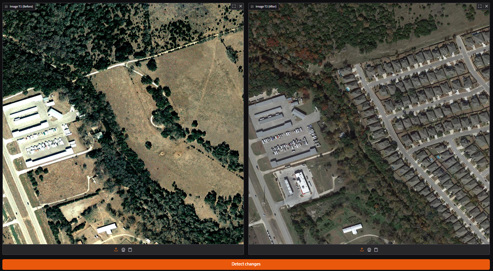
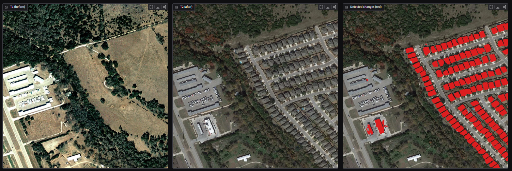

# Urban Change Detection


Satellite imagery change detection using a Siamese U-Net with a pretrained ResNet34 encoder. Given two images of the same area taken at different dates, the model produces a pixel-level mask of changed regions.

Built by [Jeremy Maille](https://www.linkedin.com/in/jeremy-maille-3202912a7), AI/ML engineering student.

🚀 **[Try the live demo](https://huggingface.co/spaces/JeremyMaille/urban-change-detection-interface)**

---

## Problem

Given two satellite images of the same location at two different dates, detect pixel-by-pixel what has changed: new buildings, demolitions, urban expansion.

Real-world applications: construction site monitoring, illegal urban expansion detection, post-disaster damage assessment, industrial facility surveillance.

---

## Demo Usage

<p align="center">
  
</p>

<p align="center">
  
</p>

**1. Prepare two satellite images of the same area at two different dates.**
Any RGB image works: Google Earth, Sentinel-2, or LEVIR-CD patches. Images are automatically resized to 256x256.

**2. Upload the "before" image (T1) on the left panel and the "after" image (T2) on the right panel.**

**3. Click "Detect changes".**
The model returns three outputs:
- **T1 (before)** - reference image
- **T2 (after)** - recent image
- **Detected changes (red)** - overlay with changed pixels highlighted in red

The percentage of pixels detected as changed is displayed below the results.

> **Note:** the model was trained on 0.5 m/pixel imagery. Results are best on high-resolution images of urban areas.

---

## Results

| Model | F1 | IoU | Precision | Recall |
|-------|----|-----|-----------|--------|
| CVA Baseline (non-ML) | 0.095 | 0.050 | 0.054 | 0.421 |
| **Siamese U-Net + ResNet34** | **0.536** | **0.450** | **0.532** | **0.607** |

**+464% F1 over the non-ML baseline.**

Evaluated on scenes entirely unseen during training. Train/val split is performed at the image level to prevent data leakage between patches from the same scene.

> Binary change detection on urban imagery is a notoriously hard task due to severe class imbalance (~4.6% changed pixels) and seasonal variations that must be ignored. Published results on LEVIR-CD range from 0.50 to 0.92 depending on model complexity and compute budget.

<p align="center">
  
</p>

<p align="center">
  
</p>

---

## Dataset

**LEVIR-CD+** (2021)

- 985 bi-temporal image pairs at 0.5 m/pixel resolution
- 1024x1024 px images cropped into 256x256 patches for training
- Binary annotation: change / no-change focused on buildings
- Severe class imbalance: ~4.6% changed pixels
- Train/val split at image level to prevent patch-level data leakage

---

## Architecture

**Siamese U-Net with pretrained ResNet34 encoder**

```
T1 --> [ ResNet34 Encoder ] --> features_T1 --> |diff| --> [ Decoder ] --> mask
                                                             ^
T2 --> [ ResNet34 Encoder ] --> features_T2 --> |diff| --+
       (shared weights)
```

The encoder is shared between both dates. T1 and T2 are projected into the same feature space, making their difference semantically meaningful. Skip connections carry the absolute feature difference at each spatial level, making the decoder sensitive to change at all scales.

**Key design choices:**

- Pretrained ResNet34 encoder with differentiated learning rate (lr/10) to preserve ImageNet features
- Combined loss: weighted BCE (pos_weight=10) + Dice to handle the 95/5 class imbalance
- Dropout2d=0.2 in the decoder for regularization
- ImageNet normalization applied to both dates
- Early stopping on val F1 (patience=10)
- Parameters: 23.8M

---

## Stack

```
PyTorch · TorchGeo · torchvision
Google Colab T4 GPU
Python 3.11
```

---

## Structure

```
urban-change-detection/
├── src/
│   ├── datasets/       # LEVIRPatchDataset, make_dataloaders
│   ├── models/         # SiameseUNet (ResNet34), CVA baseline
│   ├── training/       # CombinedLoss, train_one_epoch, evaluate
│   └── serving/
├── notebooks/
│   ├── 01_eda.ipynb    # LEVIR-CD+ exploration
│   └── 02_train.ipynb  # Colab training notebook (Run All)
├── demo/
│   └── app.py          # Gradio interface
└── requirements.txt
```

---

## Reproduce

**Requirements:** Google account with Colab access and ~5 GB Drive storage.

```bash
git clone https://github.com/JeremyMaille/urban-change-detection.git
```

Open `notebooks/02_train.ipynb` on Google Colab (Runtime > T4 GPU) and run all cells. The notebook clones the repo, downloads LEVIR-CD+ and starts training automatically.

---

## Author

**Jeremy Maille** - AI/ML Engineering Student, CESI Ecole d'Ingenieurs (Bac+5)

[GitHub](https://github.com/JeremyMaille) · [LinkedIn](https://www.linkedin.com/in/jeremy-maille-3202912a7)