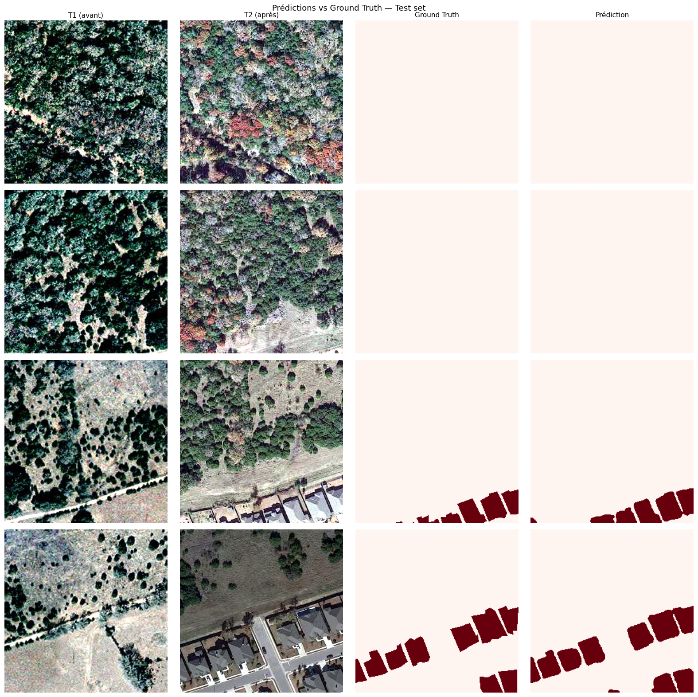
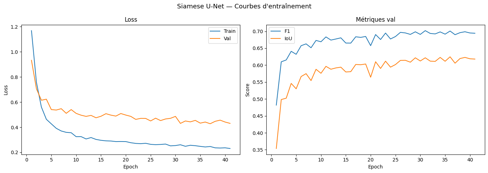

# Urban Change Detection

Détection de changement urbain par imagerie satellite à l'aide d'un réseau siamois U-Net avec encodeur ResNet34 pré-entraîné. Le modèle compare deux images de la même zone géographique prises à des dates différentes et produit un masque pixel par pixel des zones ayant changé.



---

## Résultats

| Modèle | F1 | IoU | Précision | Rappel |
|--------|-----|-----|-----------|--------|
| Baseline CVA (non-ML) | 0.095 | 0.050 | 0.054 | 0.421 |
| **Siamese U-Net + ResNet34** | **0.536** | **0.450** | **0.532** | **0.607** |

**+464% de F1 par rapport à la baseline non-ML.**

Évaluation honnête sur scènes entièrement inédites (test set). La séparation train/val est faite au niveau des images source pour éviter tout data leakage entre patches d'une même scène.



---

## Problème

Étant donné deux images satellite de la même zone à deux dates différentes, détecter pixel par pixel ce qui a changé (nouvelles constructions, démolitions, expansion urbaine).

Applications concrètes : suivi de chantiers, détection d'expansion urbaine illégale, évaluation de dégâts post-catastrophe, surveillance d'installations industrielles.

---

## Dataset

**LEVIR-CD+** : dataset de référence en change detection (2021)

- 985 paires d'images bi-temporelles, résolution 0.5 m/pixel
- Images 1024×1024 px découpées en patches 256×256 pour l'entraînement
- Annotation : masque binaire change / no-change centré sur les bâtiments
- Déséquilibre de classe sévère : ~4.6% de pixels "changé"
- Séparation train/val au niveau des images (pas des patches) pour éviter le data leakage

---

## Architecture

**Siamese U-Net avec encodeur ResNet34 pré-entraîné ImageNet**

```
T1 ──→ [ ResNet34 Encoder ] ──→ features_T1 ──→ |diff| ──→ [ Decoder ] ──→ masque
                                                              ↑
T2 ──→ [ ResNet34 Encoder ] ──→ features_T2 ──→ |diff| ──┘
        (poids partagés)
```

L'encodeur est partagé entre les deux dates, T1 et T2 sont projetés dans le même espace de features, rendant leur différence sémantiquement comparable. Les skip connections transmettent la différence absolue de features à chaque niveau spatial, ce qui rend le décodeur sensible au changement à toutes les échelles.

**Choix techniques clés :**

- Encodeur ResNet34 pré-entraîné ImageNet avec learning rate différencié (lr/10) pour préserver les features pré-apprises
- Loss combinée BCE pondérée (pos_weight=10) + Dice pour gérer le déséquilibre 95/5
- Dropout2d=0.2 dans le décodeur pour la régularisation
- Normalisation ImageNet appliquée aux deux dates
- Early stopping sur le val F1 (patience=10)
- Paramètres : 23.8M

---

## Stack

```
PyTorch · TorchGeo · torchvision
Google Colab T4 GPU
Python 3.11
```

---

## Structure

```
urban-change-detection/
├── src/
│   ├── datasets/       # LEVIRPatchDataset, make_dataloaders
│   ├── models/         # SiameseUNet (ResNet34), baseline CVA
│   ├── training/       # CombinedLoss, train_one_epoch, evaluate
│   └── serving/        # (à venir)
├── notebooks/
│   ├── 01_eda.ipynb    # Exploration LEVIR-CD+
│   └── 02_train.ipynb  # Entraînement Colab 
├── configs/
└── requirements.txt
```

---

## Reproduire les résultats

**Prérequis :** compte Google avec accès Colab et ~5 GB de stockage Drive.

```bash
git clone https://github.com/JeremyMaille/urban-change-detection.git
```

Ouvrir `notebooks/02_train.ipynb` sur Google Colab (Runtime → T4 GPU) et exécuter toutes les cellules. Le notebook clone le repo, télécharge LEVIR-CD+ et lance l'entraînement automatiquement.

---

## Auteur

**Jérémy Maille** Étudiant ingénieur IA/ML, CESI École d'Ingénieurs (Bac+5)

[GitHub](https://github.com/JeremyMaille) 